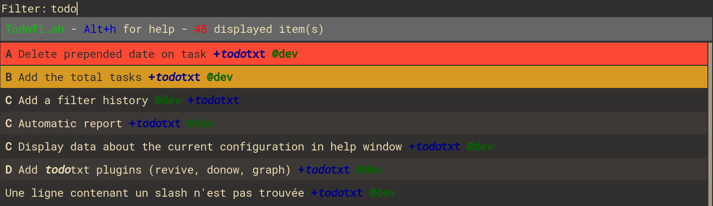

# Todofi.sh

Todo-txt + Rofi = Todofi.sh

Handle your [todo-txt](http://todotxt.org/) tasks directly from [Rofi](https://github.com/DaveDavenport/rofi)



## Features

* Mark as done
* Create, Edit, Delete
* Edit priority, remove priority
* Apply persistent filters
* Filter from context / project
* Run command like archive, deduplicate or report
* Can apply filter from argument

## Dependencies

* rofi
* todo-txt

#### On Debian based system

```bash
sudo apt install rofi todo-txt
```

## Installation

Copy todofi.sh where you want.

## Use it

Just run `/your/path/todofi.sh`

With i3wm, you can bind todofi.sh like this `bindsym $mod+t exec /path/to/todofi.sh`

Try `todofi.sh --help` if you want to customize.
